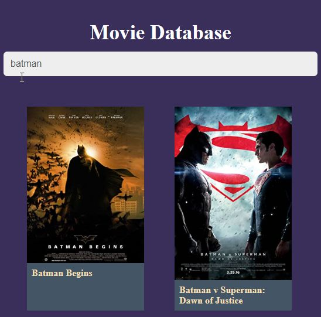

# `Movie-App`

This project was bootstrapped with [Create React App](https://github.com/facebook/create-react-app).

## what it does
It is the frontend react movie app that allow the user to  choose a favourite movie online. bundle of movies will appear on screen and the user will be able to choose one.

## `Built With`

- React.js,
- CSS3,
- Jsx

## `Live Demo`
 [Live Demo](https://determined-elion-c594af.netlify.app)

👤 **`Author`**

- Github: [@nellencr](https://github.com/nellencr)
- Twitter: [Nella](https://twitter.com/Nella75794271)
- Linkedin: [Nela Komane](https://www.linkedin.com/in/nela-komane-8866b9192/)
- Email: nellencr@gmail.com

